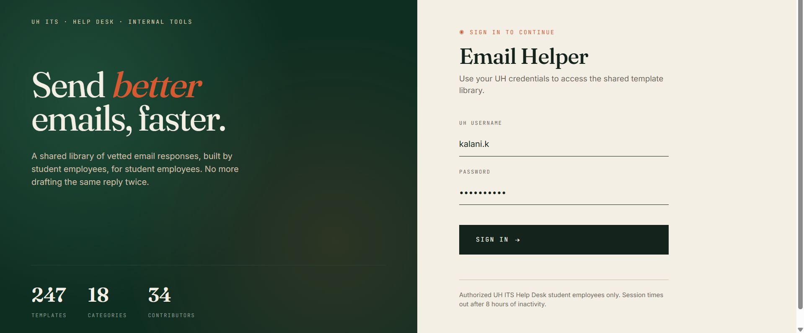
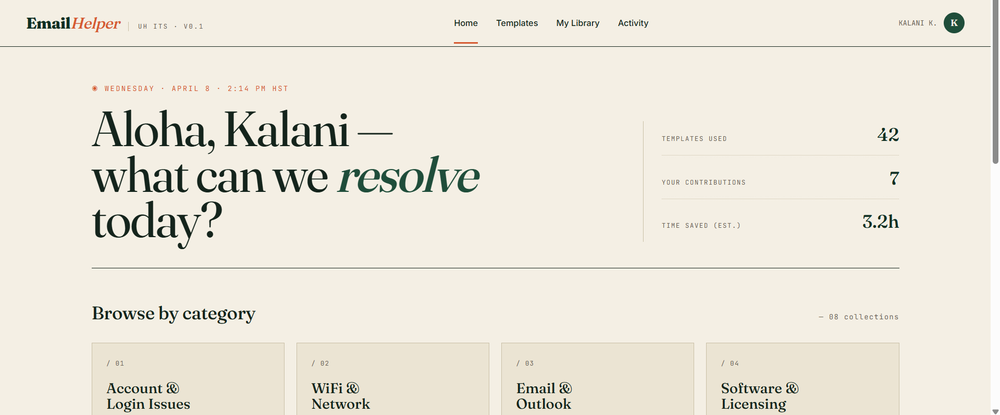
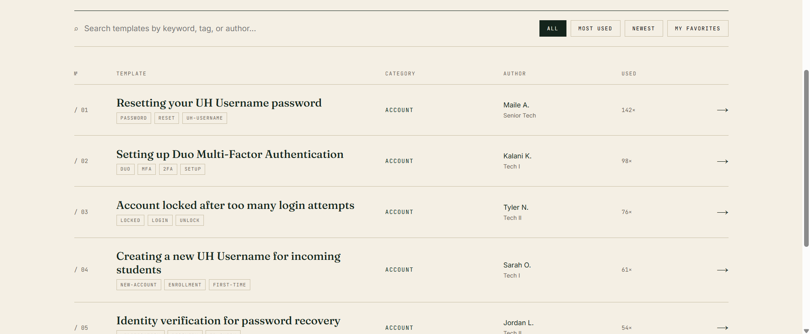
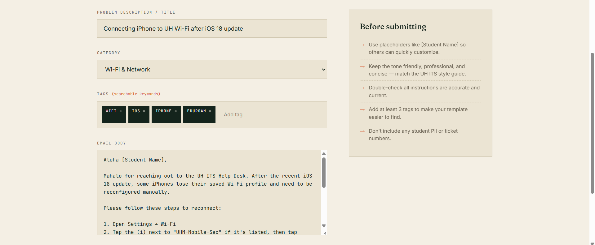
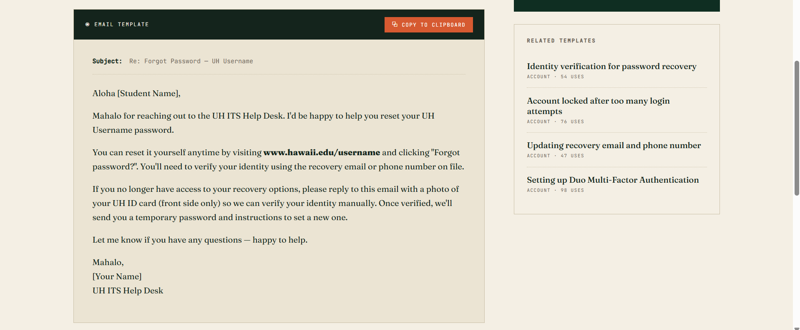
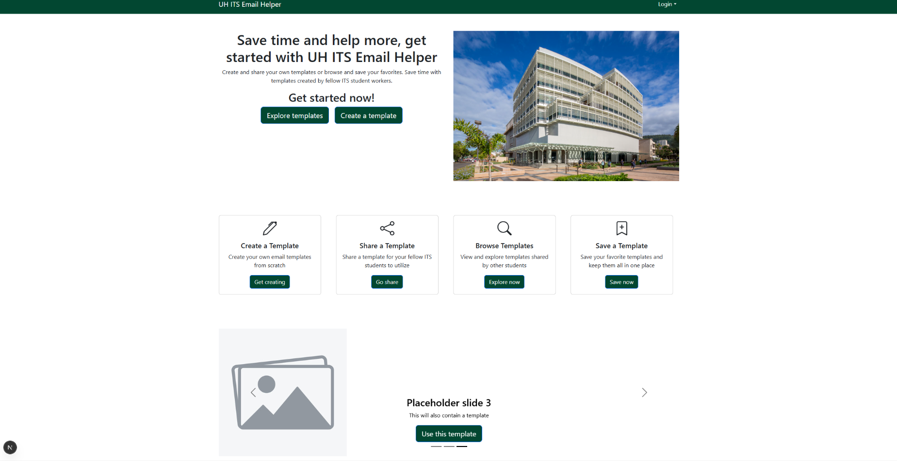
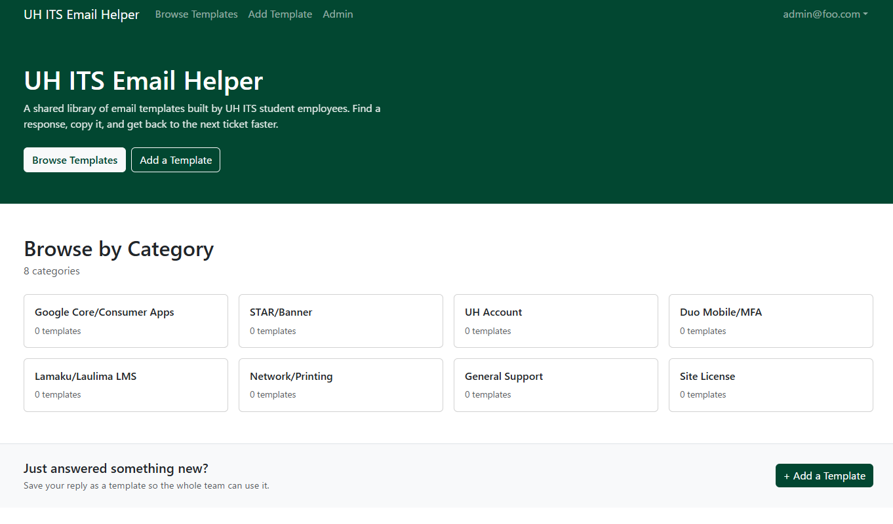
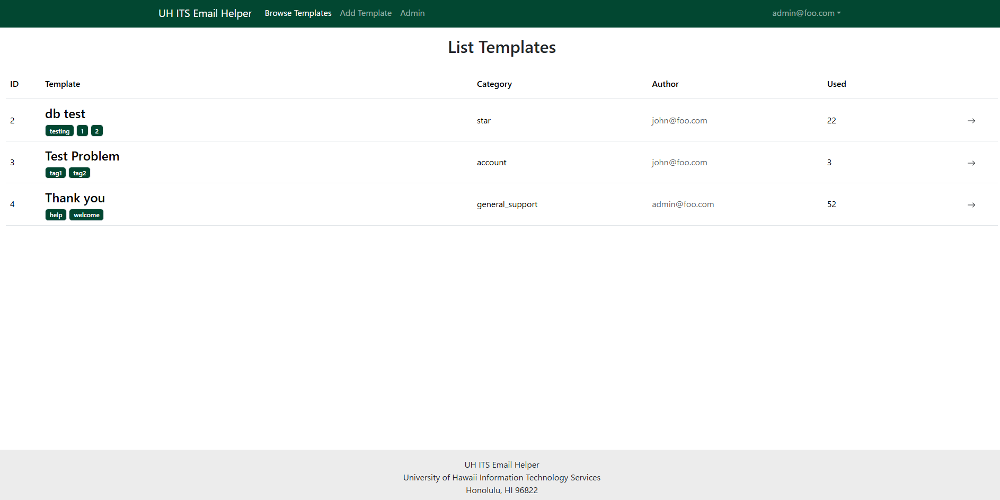
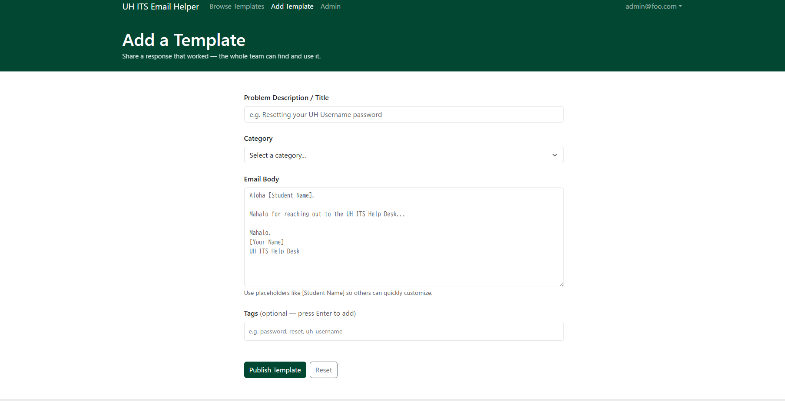

# UH ITS Email Helper

## Table of contents
* [Overview](#overview)
* [About us](#about-us)
* [Project goals](#project-goals)
* [Mockup pages](#mockup-pages)
* [Mockup page ideas](#mockup-page-ideas)
* [M1 progress](#m1-progress)

## Team Contract
<a href="https://docs.google.com/document/d/1rYpU290ztOZtVtZYAmH4tIyfcvIbfA_oV-0tPRDf_2Y/edit?tab=t.0">Visit Contract</a>

## Overview
The Problem: UH ITS Help Desk student employees respond to countless emails every day, however, typing these emails takes a lot of time and effort to ensure accuracy and professionalism. While TeamDynamix has a feature for email templates that allow you to respond to common issues and concerns with a few clicks, these do not encompass most of the common issues that users experience. While you can also create your own templates in TeamDynamix, students are limited to 20 hours of work per week; their personal library of templates will be small, inconvenient to manage, and possibly provide inaccurate solutions.

The Solution: UH ITS Email Helper provides a database of shared email templates created by the student employees. With a shared library of templates, student employees are able to use other’s templates, provide feedback and suggestions, and upload their own templates to the database.

## Deployment
<a href="https://uh-its-email-helper.vercel.app/">Vercel Deployment</a>

## About us
* <a href="https://github.com/orgs/ICS314-Group-4/repositories/">Github Organization</a>
https://github.com/orgs/ICS314-Group-4/repositories
* Andrew Wdzieczkowski  
  Major: Computer Engineering
* Dylan Elies  
  Major: Political science/Japanese 
  Minor: Computer Science
* Chase Obuhanych 
  Major: Computer Science 
* Skyler Remata 
  Major: Computer Science
* <a href="https://docs.google.com/document/d/1rYpU290ztOZtVtZYAmH4tIyfcvIbfA_oV-0tPRDf_2Y/edit?usp=sharing/">Team Contract</a>

## Project goals:
* Database of email templates
* Reduce mental fatigue on UH ITS Student employees from typing the same email multiple times to different users
* Users can create, update, and delete their own database entries
* Read and comment on all other entries
* Entries will be grouped in categories with a description of the problem as the title
* Allow student employees to effectively respond to tickets with a few clicks instead of drafting and revising a professional email for common issues.

## Mockup pages:

## Mockup page ideas:
* Log in page
* Home page
* Template listings page/search results
* Add template page
* View and use template page

## M1 Progress:

