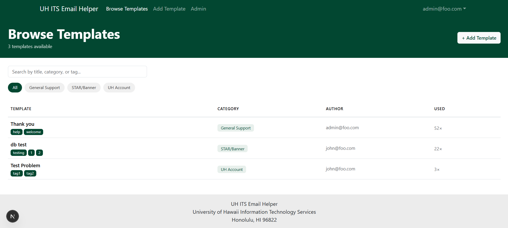
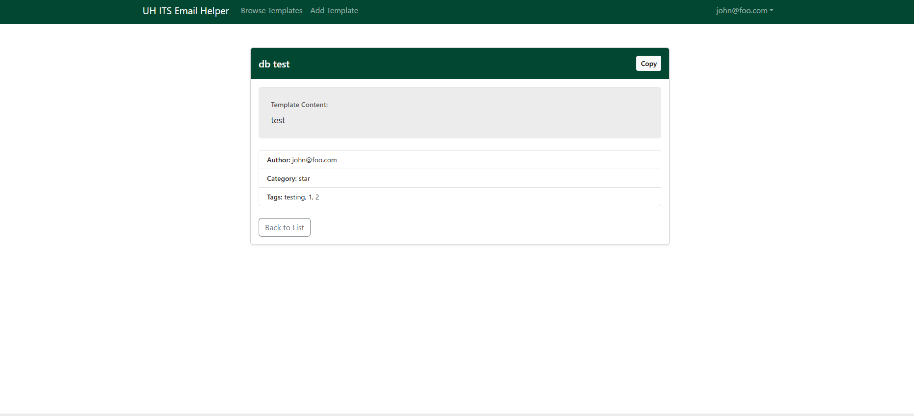
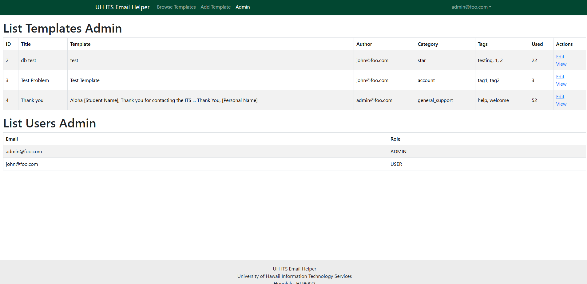

# UH ITS Email Helper

## Table of contents
* [Overview](#overview)
* [About us](#about-us)
* [Project goals](#project-goals)
* [Mockup pages](#mockup-pages)
* [Milestone 1](#milestone-1)
* [Milestone 2](milestone-2)

## Deployment
<a href="https://uh-its-email-helper.vercel.app/">Vercel Deployment</a>

## Overview
The Problem: UH ITS Help Desk student employees respond to countless emails every day, however, typing these emails takes a lot of time and effort to ensure accuracy and professionalism. While TeamDynamix has a feature for email templates that allow you to respond to common issues and concerns with a few clicks, these do not encompass most of the common issues that users experience. While you can also create your own templates in TeamDynamix, students are limited to 20 hours of work per week; their personal library of templates will be small, inconvenient to manage, and possibly provide inaccurate solutions.

The Solution: UH ITS Email Helper provides a database of shared email templates created by the student employees. With a shared library of templates, student employees are able to use other’s templates, provide feedback and suggestions, and upload their own templates to the database.

## About us
* <a href="https://github.com/orgs/ICS314-Group-4/repositories/">Github Organization</a>
* <a href="https://docs.google.com/document/d/1rYpU290ztOZtVtZYAmH4tIyfcvIbfA_oV-0tPRDf_2Y/edit?usp=sharing/">Team Contract</a>
* Andrew Wdzieczkowski  
  Major: Computer Engineering
* Dylan Elies  
  Major: Political science/Japanese 
  Minor: Computer Science
* Chase Obuhanych 
  Major: Computer Science 
* Skyler Remata 
  Major: Computer Science

## Project goals:
* Database of email templates
* Reduce mental fatigue on UH ITS Student employees from typing the same email multiple times to different users
* Users can create, update, and delete their own database entries
* Read and comment on all other entries
* Entries will be grouped in categories with a description of the problem as the title
* Allow student employees to effectively respond to tickets with a few clicks instead of drafting and revising a professional email for common issues.

## Mockup pages:

  
Click to show images

   
  
  
  
  
  

## Milestone 1:
<a href="https://github.com/orgs/ICS314-Group-4/projects/1">Github Project</a>

  
Click to show images and user guide

   
  <h3>Landing page</h3>
  Upon opening the website, users will be greeted by a landing page explaining some of the capabilities of UH ITS Email Helper.
  
   
  <h3>Home page</h3>
  After a user creates an account and signs in, they will be taken to the home page where they will be able to create or browse user-created email templates.
  
   
  <h3>Browse templates</h3>
  When browsing templates, users will be able to see every template in the database either unsorted or filtered by category, title, and tags.
  
   
  <h3>View/use template</h3>
  When a user selects a template, they are taken to a page where they can see and copy the full template text with one click. In M2, the site will be able to automatically append the user's signature to the end.
  
   
  <h3>Create template</h3>
  To add/create a new template, users enter the title, choose a category out of multiple options, write the actual template, then add any number of tags. 
  
   
  <h3>Admin page</h3>
  Admin users can open the admin page, where they can edit and view all published templates and users. 
  

## Milestone 2:
<a href="https://github.com/orgs/ICS314-Group-4/projects/2">Github Project</a>
